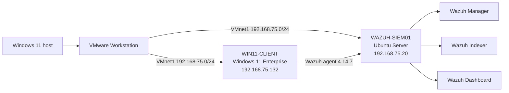

# Windows SOC Home Lab with Wazuh


Hands-on Security Operations Center lab built with VMware Workstation, Wazuh, and Windows 11. The project demonstrates endpoint onboarding, Windows event collection, alert validation, and basic incident triage in an isolated virtual network.


## Recruiter quick view


| Area | Demonstrated outcome |
|---|---|
| SIEM operations | Deployed and validated Wazuh manager, indexer, dashboard, and Filebeat |
| Endpoint onboarding | Connected and monitored a Windows 11 endpoint |
| Alert triage | Investigated Windows logon failure Event ID `4625` |
| Evidence handling | Produced a sanitized validation summary and incident report |
| Lab safety | Used an isolated host-only VMware network with no production data |


**Start here:** [Incident Report 001](incident-reports/incident-report-001.md) · [Validation summary](evidence/validation-summary.txt)


## Validated lab evidence


At the recorded validation time on 2026-08-10, the Wazuh manager, indexer, and dashboard were active. Windows agent `001` was registered and reported as active on the private laboratory network.


The recorded Windows endpoint evidence includes Sysmon process telemetry. Both `Sysmon64` and `WazuhSvc` were configured for automatic startup and were running during collection.


## Lab architecture





## Components


| Component | Platform | Purpose |
|---|---|---|
| WAZUH-SIEM01 | Ubuntu Server 24.04 LTS | Wazuh manager, indexer, dashboard, and Filebeat |
| WIN11-CLIENT | Windows 11 Enterprise Evaluation | Monitored endpoint with Wazuh agent |
| VMnet1 | Host-only virtual network | Isolated communication between lab systems |


## Lab inventory status

| Component | Status |
| --- | --- |
| WAZUH-SIEM01 | Verified and documented |
| WIN11-CLIENT | Verified and documented |
| KALI01 | Documented in the Attack-to-Detection Wazuh Lab |
| SRV-DC01 | DNS, Kerberos, LDAP, Global Catalog, SMB, and WinRM services verified externally; internal role configuration still requires authenticated review |
| PFSENSE01 | VM present with NAT and VMnet1 assigned; internal configuration not yet documented |

See [SOC Lab Inventory](docs/lab-inventory.md) for verified platform, network, and evidence boundaries.

See [SRV-DC01 External Validation](docs/srv-dc01-validation.md) for the network service evidence and documented limitations.

## Status recorded during validation


- Wazuh Manager 4.14.7: active
- Wazuh Indexer 4.14.7: active
- Wazuh Dashboard 4.14.7: active
- Filebeat: active
- Windows endpoint agent ID `001`: active
- Dashboard HTTPS endpoint: reachable
- File Integrity Monitoring scan: completed successfully
- Windows Security events: received and analyzed


## Detection scenarios

| Scenario | Event ID or source | Wazuh rule | MITRE ATT&CK | Evidence boundary |
| --- | --- | --- | --- | --- |
| Failed Windows logon | Windows Security `4625` | `60122` | Wazuh associated `T1531`; analyst review found failed authentication, not confirmed account access removal | [Incident Report 001](incident-reports/incident-report-001.md) |
| Windows process creation | Windows Security `4688` | `67027` | No mapping claimed in the published evidence | [Validation summary](evidence/validation-summary.txt) |
| Authorized PowerShell simulation | Sysmon `1` | Custom rule `100100`, level `10` | `T1059.001` PowerShell | Documented in the [Attack-to-Detection Wazuh Lab](https://github.com/Eliran1991-sudo/Attack-to-Detection-Wazuh-Lab) |
| Controlled Kali reconnaissance | Authorized Nmap scan | No Wazuh alert claimed for the scan | `T1046` Network Service Discovery | Documented in the [Attack-to-Detection Wazuh Lab](https://github.com/Eliran1991-sudo/Attack-to-Detection-Wazuh-Lab) |

The table separates locally published evidence from scenarios documented in the advanced repository. It does not claim that every activity generated a Wazuh alert.

## Repository structure

```text
detection-rules/   Detection inventory and links to validated rule implementations
docs/              Architecture, inventory, and system-validation documentation
evidence/          Sanitized machine-readable validation summaries
incident-reports/  Completed reports and a reusable report template
screenshots/       Reviewed images used by the documentation
```

## Related projects

- [Attack-to-Detection Wazuh Lab](https://github.com/Eliran1991-sudo/Attack-to-Detection-Wazuh-Lab): extends this foundation with Sysmon telemetry, controlled Kali reconnaissance, a custom Wazuh rule, MITRE ATT&CK mapping, and deeper incident analysis.
- [Incident Report Template](incident-reports/incident-report-template.md): reusable structure for future evidence-based investigations.
