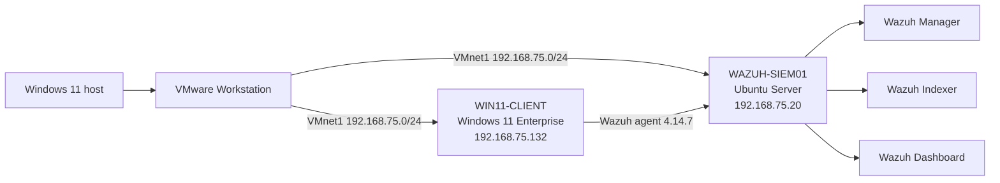

# Windows SOC Home Lab with Wazuh

Hands-on Security Operations Center lab built with VMware Workstation, Wazuh, and Windows 11. The project demonstrates endpoint onboarding, Windows event collection, alert validation, and basic incident triage in an isolated virtual network.

## Recruiter quick view

| Area | Demonstrated outcome |
|---|---|
| SIEM operations | Deployed and validated Wazuh manager, indexer, dashboard, and Filebeat |
| Endpoint onboarding | Connected and monitored a Windows 11 endpoint |
| Alert triage | Investigated Windows logon failure Event ID `4625` |
| Evidence handling | Produced a sanitized validation summary and incident report |
| Lab safety | Used an isolated host-only VMware network with no production data |

**Start here:** [Incident Report 001](docs/incident-report-001.md) · [Validation summary](evidence/validation-summary.txt)

## Live lab evidence

The Wazuh manager, indexer, and dashboard are active. Windows agent `001` is registered and reports as active on the private laboratory network.

The monitored Windows endpoint also reports live Sysmon process telemetry. Both `Sysmon64` and `WazuhSvc` are configured for automatic startup and were running during collection.

## Lab architecture

## Components

| Component | Platform | Purpose |
|---|---|---|
| WAZUH-SIEM01 | Ubuntu Server 24.04 LTS | Wazuh manager, indexer, dashboard, and Filebeat |
| WIN11-CLIENT | Windows 11 Enterprise Evaluation | Monitored endpoint with Wazuh agent |
| VMnet1 | Host-only virtual network | Isolated communication between lab systems |

## Verified status

- Wazuh Manager 4.14.7: active
- Wazuh Indexer 4.14.7: active
- Wazuh Dashboard 4.14.7: active
- Filebeat: active
- Windows endpoint agent ID `001`: active
- Dashboard HTTPS endpoint: reachable
- File Integrity Monitoring scan: completed successfully
- Windows Security events: received and analyzed

## Detection scenario: failed Windows logon

A controlled invalid guest-login attempt was performed against `WIN11-CLIENT`. Windows generated Security Event ID `4625`, which the Wazuh agent forwarded to the manager.

Wazuh correlated the event as:

- Rule ID: `60122`
- Severity: Level 5
- Description: `Logon Failure - Unknown user or bad password`
- Source channel: `Windows Security`
- Decoder: `windows_eventchannel`
- Endpoint: `WIN11-CLIENT`

The same collection pipeline also captured process creation events (`4688`) using Wazuh rule `67027`.

## Analyst triage

1. Confirmed that the source endpoint was the isolated Windows lab VM.
2. Reviewed the failed account name, logon type, caller process, and timestamp.
3. Correlated repeated failures occurring within the same short time window.
4. Identified the caller as VMware Tools during an authorized lab access test.
5. Classified the activity as a controlled true positive with no malicious impact.

See [Incident Report 001](docs/incident-report-001.md) for the full investigation notes.

## Skills demonstrated

- SIEM deployment and health validation
- Windows endpoint onboarding
- Windows Security Event Log analysis
- Authentication-failure detection
- Process-creation monitoring
- Alert triage and false-positive context
- Basic MITRE ATT&CK mapping review
- Evidence-based incident documentation

## Security and privacy

This repository contains no passwords, private keys, enrollment keys, personal addresses, or production data. IP addresses belong only to an isolated local lab network.

## Portfolio progression

The next stage of this lab is documented in [Attack-to-Detection Wazuh Lab](https://github.com/Eliran1991-sudo/Attack-to-Detection-Wazuh-Lab), which adds Sysmon telemetry, PowerShell detection, a custom Wazuh rule, controlled Kali reconnaissance, MITRE ATT&CK mapping, and deeper evidence-based triage.

## Future improvements

- Add a sanitized screenshot of the Wazuh dashboard alert timeline.
- Build a multi-event brute-force correlation rule.
- Add a second Windows endpoint to compare normal and suspicious activity.
